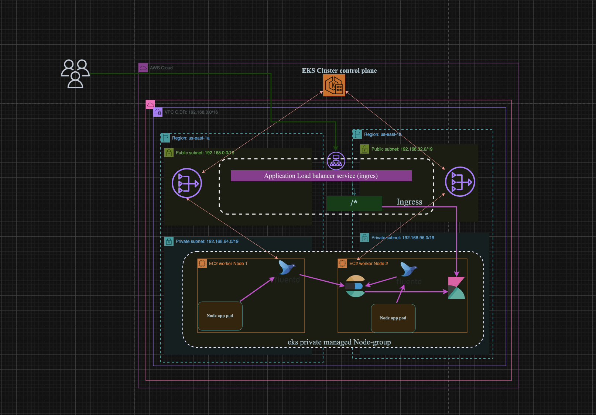
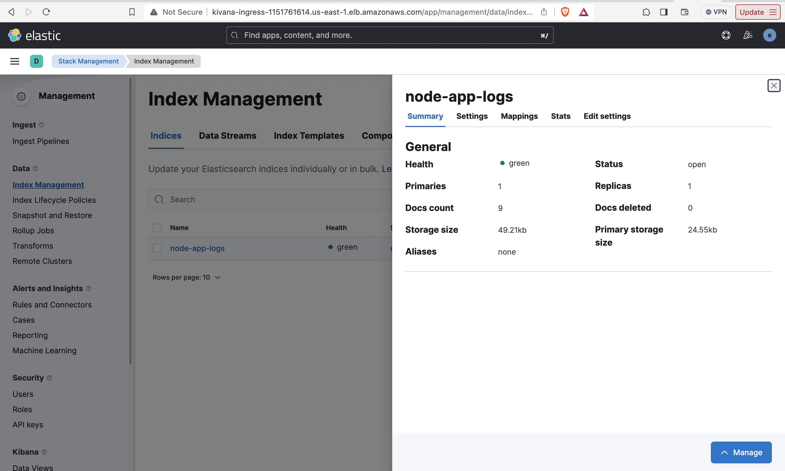
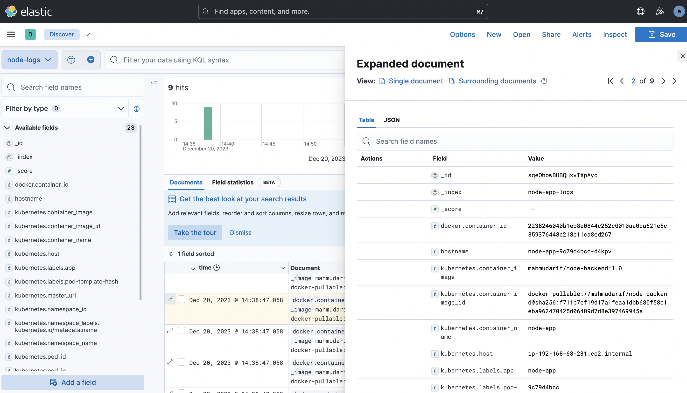
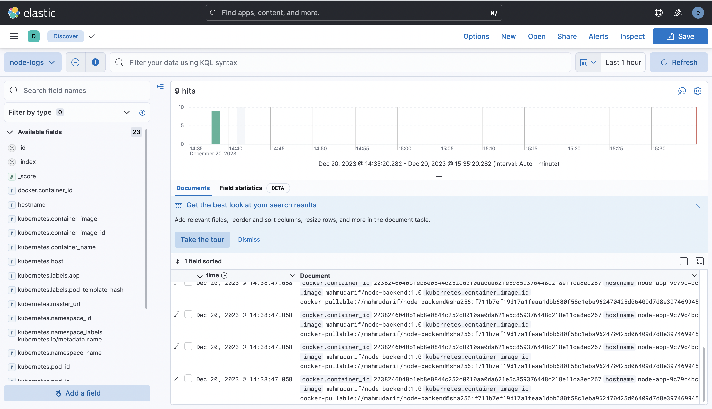

# EKS Cluster and EFK(elasticsearch, fluentd, kivana) stack setup

## Network Architecture which we are going to deploy




I use makefile to simplify running Command

A Makefile is a powerful tool that simplifies the process of managing and automating complex tasks in software development and system administration. It serves as a build automation tool that orchestrates the execution of commands to streamline the development, deployment, and maintenance processes.

Before running the Makefile, ensure that you have the following prerequisites:

- [eksctl](https://eksctl.io/) installed
- [kubectl](https://kubernetes.io/docs/tasks/tools/install-kubectl/) installed
- [AWS CLI](https://aws.amazon.com/cli/) installed and configured
- [Helm](https://helm.sh/docs/intro/install/) installed
- A valid SSH key pair for SSH access to the nodes


## Usage

1. **Create EKS Cluster:**

    ```bash
    make create_cluster
    ```

2. **Deploy Private Node Group:**

    ```bash
    make deploy_private_nodegroup
    ```

3. **Create OIDC:**

    ```bash
    make create_oidc
    ```

4. **Create Policy for CSI Driver:**

    ```bash
    make create_policy_for_CSI
    ```

5. **Attach CSI Policy to Worker Node Role:**

    ```bash
    make attach_csi_policy_node_role
    ```

6. **Deploy CSI Driver:**

    ```bash
    make deploy_csi_driver
    ```

7. **Create Storage Class:**

    ```bash
    make create_storage_class
    ```

8. **Install Elasticsearch:**

    ```bash
    make install_elasticsearch
    ```

9. **Install Kibana:**

    ```bash
    make install_kibana
    ```

10. **Create Load Balancer Policy:**

    ```bash
    make create_lb_policy
    ```

11. **Create Service Account:**

    ```bash
    make create_service_account
    ```

12. **Install AWS Load Balancer Controller:**

    ```bash
    make install_aws_loadbalancer
    ```

13. **Install Fluentd:**

    ```bash
    make install_fluentd
    ```

## Notes

- Ensure your AWS CLI is configured with the necessary permissions.
- Replace placeholders in the Makefile commands with your actual values.
- Customize configurations in the Makefile according to your specific requirements.


## Node app  Deployment manifest

```yaml
apiVersion: apps/v1
kind: Deployment
metadata:
  name: node-app
  labels:
    app: node-app
spec:
  replicas: 1
  selector:
    matchLabels:
      app: node-app
  template:
    metadata:
      labels:
        app: node-app
    spec:
      containers:
        - name: node-app
          image: mahmudarif/node-backend:1.0
          imagePullPolicy: Always
          ports:
            - containerPort: 3000
      # imagePullSecrets:
      #   - name: myregistrysecret
```

## Ingress Class

```yaml
apiVersion: networking.k8s.io/v1
kind: IngressClass
metadata:
  name: my-ingress-class
  annotations:
    ingressclass.kubernetes.io/is-default-class: "true"
spec:
  controller: ingress.k8s.aws/alb
```

## Ingress rule for Kivana Dashboard

```yaml
apiVersion: networking.k8s.io/v1
kind: Ingress
metadata:
  name: ingress-kivana-demo
  annotations:
    # Load Balancer Name
    alb.ingress.kubernetes.io/load-balancer-name: kivana-ingress
    # Ingress Core Settings
    alb.ingress.kubernetes.io/scheme: internet-facing
    alb.ingress.kubernetes.io/target-type: ip
    
spec:
  ingressClassName: my-ingress-class   # Ingress Class                       
  rules:
    - http:
        paths:
        - path: / 
          pathType: Prefix
          backend:
            service:
              name: kibana-kibana
              port:
                number: 5601
```

## Fluntd Configmap for collecting node-app logs

```yaml
kind: ConfigMap
apiVersion: v1
metadata:
  name: fluentd-forwarder-cm
  namespace: default
  labels:
    app.kubernetes.io/component: forwarder
    app.kubernetes.io/instance: fluentd
    app.kubernetes.io/managed-by: Helm
    app.kubernetes.io/name: fluentd
    helm.sh/chart: fluentd-1.3.0
  annotations:
    meta.helm.sh/release-name: fluentd
    meta.helm.sh/release-namespace: default
data:
  fluentd.conf: |

    # Ignore fluentd own events
    <match fluent.**>
        @type null
    </match>

    # HTTP input for the liveness and readiness probes
    <source>
        @type http
        port 9880
    </source>

    # Throw the healthcheck to the standard output instead of forwarding it
    <match fluentd.healthcheck>
        @type null
    </match>

    # Get the logs from the containers running in the node
    <source>
      @type tail
      path /var/log/containers/*-app*.log
      pos_file /opt/bitnami/fluentd/logs/buffers/fluentd-docker.pos
      tag kubernetes.*
      read_from_head true
      format json
      time_format %Y-%m-%dT%H:%M:%S.%NZ
    </source>

    <filter **>
      @type parser
      key_name log
      <parse>
        @type multi_format
        <pattern>
          format json
          time_key time
          keep_time_key true
        </pattern>
      </parse>
    </filter>

    # enrich with kubernetes metadata
    <filter kubernetes.**>
        @type kubernetes_metadata
    </filter>


 

    <match kubernetes.var.log.containers.**node-app**.log>
      @type elasticsearch
      include_tag_key true
      host "elasticsearch-master.default.svc.cluster.local"
      port "9200"
      user elastic
      password Z1GqTb6fV2X28yuf
      scheme https
      ssl_verify false
      index_name "node-app-logs"
      <buffer>
        @type file
        path /opt/bitnami/fluentd/logs/buffers/node-logs.buffer
        flush_thread_count 2
        flush_interval 5s
      </buffer>
    </match>
```

## Now apply ingress and fluntd configuration 

```bash
# Navigate to Directory
manifest

# Deploy ingress
make deploy_ingress_and_rules

# Deploy node app
make deploy_node_app

# get username and password for kivana dashboard

make get_kivana_credentials


# apply fluntd config file & rollout fluntd demonset
make configure_fluntd

```

## view logs in Kivana dashboard

<div align="center">
  
  
  
</div>

